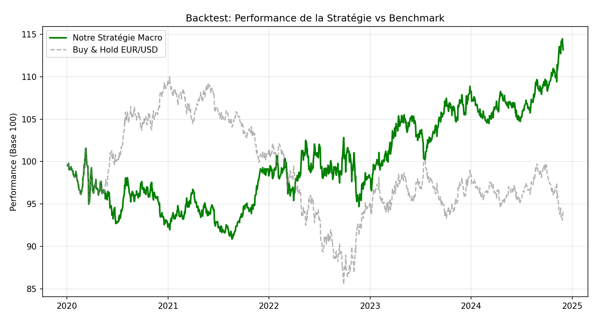

# Global Macro FX Strategy: EUR/USD Yield Differential

### Project Overview
This project, developed in preparation for the **CFA Level I** and during the MSc in Management at **NEOMA Business School**, implements a systematic backtesting framework for the **EUR/USD** pair driven by the US 10-Year Treasury yield trends.

**Objective:** To quantify the performance and identify the drivers of a Macro-economic trend-following strategy over the 2020-2024 period.

---

### Methodology & Technical Stack

Initially prototyped in Excel/VBA for the concept phase, the strategy was migrated to a Python architecture for robustness and vectorized backtesting.

* **Language:** Python 3.10+
* **Libraries:** `pandas`, `numpy`, `matplotlib`, `yfinance`
* **Workflow:** Automated pipeline (Extraction -> Signal -> Execution).

#### The Trading Logic
The strategy is based on the premise that capital flows towards currencies offering superior short-term yield.
1.  **Indicator:** 50-Day Simple Moving Average (SMA) of the US 10-Year Yield (`^TNX`).
2.  **Signal Generation:** Position **Short EUR/USD** when US yields enter a structural upward trend.
3.  **Rigor:** Signals are lagged by one day to prevent "look-ahead bias" in the backtesting process.

---

### Performance Metrics (2020 - 2024)

The backtest confirms a strong directional correlation, particularly during periods of clear monetary policy divergence.

| Metric | Strategy | Benchmark (Long EUR) |
| :--- | :--- | :--- |
| **Total Return** | **+13.18%** | -5.86% |
| **Sharpe Ratio** | **0.37** | N/A |
| **Exposure** | Long / Short | Long Only |

#### Visualization
The chart below illustrates the strategy's cumulative returns (Strategy vs. Benchmark).



---

### Project Execution

To run this project and reproduce the results:

1.  Clone the repository.
2.  Install the required dependencies using the provided file:
    ```bash
    pip install -r requirements.txt
    ```
3.  Execute the scripts sequentially from the `src` directory:
    ```bash
    python src/01_data_extraction.py
    python src/02_signal_generation.py
    python src/03_backtest_execution.py
    ```

---

*Author: Nils CHAVEROT - MSc in Management / CFA Level I Candidate*
